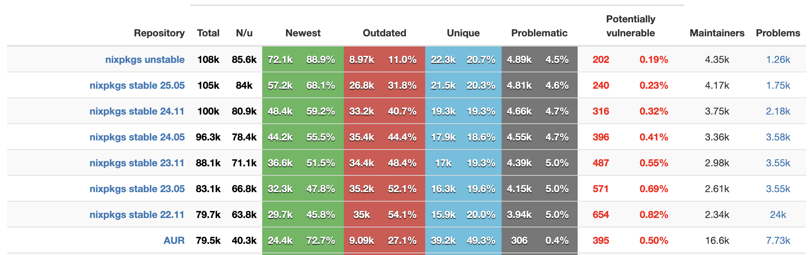

+++
date = '2025-10-04T18:55:12-03:00'
draft = false
title = 'Instalando Nix no macOS'
slug = 'nix-no-macos'
description = 'Nix no macOS, usando nix-darwin e Flakes para criar um ambiente reproduzível.'
tags = [
    'nix',
    'macos',
    'nix-darwin',
    'flakes',
    'nixpkgs',
    'installation',
    'apple-silicon',
    'package-manager',
    'developer-environment',
    'reproducible-configurations'
]
categories = [
    'tutorial',
    'nix',
    'macos'
]
showHero = true
heroStyle = 'background'
+++

# Instalando Nix no macOS

Recentemente adquiri um novo computador e, com ele, veio aquele mix de sentimentos ao configurá-lo do zero para as minhas necessidades (todo bom nerd já se divertiu bastante fazendo isso). Eu já tenho uma porção de scripts que facilitam a minha configuração inicial do computador, porém, ultimamente tenho lido e experimentado Nix e pensei: isso pode ser uma ótima oportunidade de usá-lo! Mas, afinal… o que é Nix?

A página do [projeto no Github](https://github.com/NixOS/nix) o descreve como:

> Nix is a powerful package manager for Linux and other Unix systems that makes package management reliable and reproducible.
> 

Em tradução livre: “Nix é um poderoso gerenciador de pacotes para Linux e outros sistemas Unix que torna o gerenciamento de pacotes confiável e reproduzível”.

Com a linguagem Nix, podemos definir de forma declarativa quais pacotes queremos instalar em nosso sistema. Não apenas isso, utilizando Nix como nosso gerenciador de pacotes, estaremos usando o repositório de pacotes `nixpkgs` , que, no presente momento, é o maior e mais atualizado repositório de pacotes disponível (como pode ser visto no [Repology](https://repology.org/repositories/statistics/total)):



Ok, poder declarar quais pacotes queremos instalados no nosso sistema já é algo incrível e que ajuda bastante no setup inicial de uma nova máquina, mas algo que meus scripts fazem além de instalar pacotes e aplicações é configurar o meu sistema. Felizmente, o Nix também permite isso — inclusive, há uma distribuição Linux completa construída em torno dessa proposta: o [NixOS](https://nixos.org/).

Recentemente eu comecei a experimentar o NixOS em meu homelab, com o intuito de ter VMs com setups simples e reproduzíveis. A configuração do NixOS pode ser feita completamente de forma declarativa escrita em Nix, porém para o macOS, esse suporte não é incluso por padrão e é aí que entra mais um incrível projeto: o [nix-darwin](https://github.com/nix-darwin/nix-darwin).

A página do [projeto no Github](https://github.com/nix-darwin/nix-darwin) o descreve como:

> This project aims to bring the convenience of a declarative system approach to macOS.
nix-darwin is built up around [Nixpkgs](https://github.com/NixOS/nixpkgs), quite similar to [NixOS](https://nixos.org/).
> 

Em tradução livre: “Este projeto visa trazer a conveniência de uma abordagem declarativa de sistema para o macOS. O nix-darwin é construído em torno do [Nixpkgs](https://github.com/NixOS/nixpkgs), de maneira bastante similar ao [NixOS](https://nixos.org/)”.

Após essa introdução às ferramentas usadas, vou contar quais foram os passos que segui para instalar o Nix no macOS e criar uma configuração inicial.

## Instalando o Nix no macOS

Instalar o Nix no macOS é algo bem simples, basicamente você tem que executar o seguinte comando no seu terminal:

```bash
curl -L https://nixos.org/nix/install | sh
```

Esse comando fará download do script de instalação do Nix e executá-lo no seu terminal. A instalação é super intuitiva e transparente, então basta seguir os passos dados pelo próprio script.

> ⚠️ **NOTA**:
> Caso você, assim como eu, tenha o FileVault ativado no seu macOS, pode ocorrer um problema na instalação do Nix, especificamente no bootstrap do novo volume de disco usado pelo Nix. Felizmente, o script detecta esse problema e te dá os passos para solucioná-lo: basicamente reiniciar o computador e executar o script de instalação novamente.

Após completar a instalação, para conferir que tudo ocorreu como esperado, basta abrir uma nova janela do terminal e executar o seguinte comando:

```bash
nix --version
```

Caso o comando execute com sucesso e você visualize a versão do Nix, a instalação foi bem sucedida!

## Criando uma configuração inicial com nix-darwin e Flakes

Agora que temos o Nix instalado na nossa máquina, vamos criar uma configuração inicial com suporte ao `nix-darwin`. A maneira mais simples de fazer isso é utilizando uma feature do Nix chamada [Flakes](https://nixos.wiki/wiki/Flakes). Eu não vou me aprofundar no Flakes por não ser o foco desse artigo, mas considere que é uma feature do Nix que nos ajuda a “lockar” versões de dependências.

Antes de tudo, vamos criar o diretório onde nossa configuração irá ficar. No meu caso, eu optei por usar `~/.config/nix`, mas sinta-se livre para usar qualquer localização que achar mais conveniente.

```bash
mkdir -p ~/.config/nix && cd ~/.config/nix
```

Dentro do novo diretório, vamos inicializar nossa configuração utilizando um template pronto para utilizar o `nix-darwin`. Aqui você tem a opção de criar sua configuração apontando para uma versão específica do repositório do nixpkgs ou utilizar a `unstable`. Eu optei por utilizar a `unstable` para ter a versão mais atualizada dos pacotes.

Para nixpkgs 25.05:

```bash
nix flake init -t nix-darwin/nix-darwin-25.05 --extra-experimental-features "nix-command flakes"
```

Ou para nixpkgs unstable:

```bash
nix flake init -t nix-darwin/master --extra-experimental-features "nix-command flakes"
```

Após isso, você terá um arquivo chamado `flake.nix` no seu diretório. Essa é a sua configuração nix e ela deve ser similar à essa:

```nix
{
  description = "Example nix-darwin system flake";

  inputs = {
    nixpkgs.url = "github:NixOS/nixpkgs/nixpkgs-unstable";
    nix-darwin.url = "github:nix-darwin/nix-darwin/master";
    nix-darwin.inputs.nixpkgs.follows = "nixpkgs";
  };

  outputs = inputs@{ self, nix-darwin, nixpkgs }:
  let
    configuration = { pkgs, ... }: {
      # List packages installed in system profile. To search by name, run:
      # $ nix-env -qaP | grep wget
      environment.systemPackages =
        [ pkgs.vim
        ];

      # Necessary for using flakes on this system.
      nix.settings.experimental-features = "nix-command flakes";

      # Enable alternative shell support in nix-darwin.
      # programs.fish.enable = true;

      # Set Git commit hash for darwin-version.
      system.configurationRevision = self.rev or self.dirtyRev or null;

      # Used for backwards compatibility, please read the changelog before changing.
      # $ darwin-rebuild changelog
      system.stateVersion = 6;

      # The platform the configuration will be used on.
      nixpkgs.hostPlatform = "aarch64-darwin";
    };
  in
  {
    # Build darwin flake using:
    # $ darwin-rebuild build --flake .#simple
    darwinConfigurations."simple" = nix-darwin.lib.darwinSystem {
      modules = [ configuration ];
    };
  };
}
```

Por padrão, o nome da configuração do `nix-darwin` é chamada de `simple` no template. Você pode trocar pelo nome que preferir, mas o que eu vejo comumente é utilizar o hostname da sua máquina, pois, por padrão, essa é a configuração procurada pelo `nix-darwin` ao tentar realizar build e aplicá-la.

Algo também importante é verificar o valor utilizado em `nixpkgs.hostPlatform`. Esse valor deve ser correspondente à arquitetura do processador da sua máquina:

- **aarch64-darwin** para Macs com Apple Silicon (M1, M2, M3, etc)
- **x86_64-darwin** para Macs com processador Intel

Por último, precisamos fazer apenas mais uma alteração: adicionar nossa configuração de usuário, especificando o diretório `home` dele. Para isso, basta adicionar a seguinte linha logo abaixo da linha `nixpkgs.hostPlatform = "aarch64-darwin"`:

```nix
users.users.<nome-do-seu-usuario> = "/Users/<nome-do-seu-usuario>";

# No meu caso, seria:
# users.users.lucas.home = "/Users/lucas";
```

Caso não saiba seu nome de usuário, basta executar o comando `whoami` no seu terminal.

Agora podemos usar o `darwin-rebuild` para buildar nossa configuração e aplicá-la. Nessa primeira execução, o `darwin-rebuild` ainda não está instalado em nossa máquina, então usaremos o comando `nix run` que nos permite utilizar um pacote mesmo sem ele estar instalado no momento. Outro ponto é que, para aplicar a configuração, é necessário executar o comando com `sudo`, pois o `nix-darwin` gerencia várias configurações do macOS que, para serem alteradas, precisam de privilégios de root.

```nix
sudo nix run nix-darwin/master#darwin-rebuild --extra-experimental-features "nix-command flakes" -- --flake ~/.config/nix#<nome-da-sua-config> switch
```

Lembre-se que, caso tenha usado o nome da sua configuração igual ao `hostname` da sua máquina, você pode omitir a parte `#<nome-da-sua-config>` do comando.

Depois da primeira execução, você pode buildar e aplicar a configuração usando o comando:

```nix
sudo darwin-rebuild switch --flake ~/.config/nix#<nome-da-sua-config>
```

Pronto! Sua configuração está aplicada! No momento, ela apenas instala o pacote `vim` na sua máquina, como pode ser visto em:

```nix
environment.systemPackages =
  [ pkgs.vim
  ];
```

Mas sinta-se livre para pesquisar em [search.nixos.org/packages](https://search.nixos.org/packages) os pacotes necessários para o seu uso. No próximo artigo, pretendo entrar em mais detalhes sobre como integrar o [Homebrew](https://brew.sh/) para permitir a instalação de pacotes não disponíveis no nixpkgs. Nesse meio tempo, super recomendo o [guia do nix.dev](https://nix.dev/tutorials/nix-language.html) sobre a linguagem Nix e seu funcionamento.

